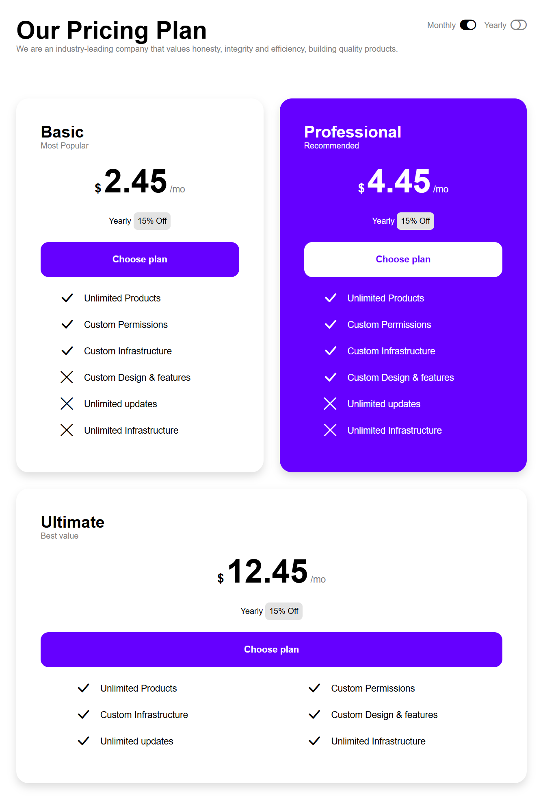
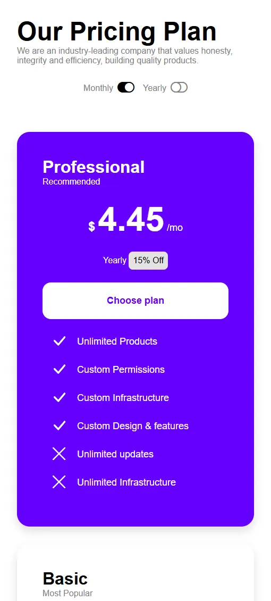

# PRICING PLAN HTML/CSS
This project is the fifth exercise in the context of a Web Development Master Course. It is focused on HTML and CSS, including CSS Flexbox, and an advanced focused on object positioning and layout. This includes the use of media queries for a responsive layout for mobile, tablet and desktop.

## TASK
The task is re-creating a web-page, provided by the teacher, by using HTML and CSS. This webpage is landing page showing 3 different price plans and the features included in each "package" &#40;for each price&#41;. The objective is to obtain a finalized page with responsive layout focused on structural CSS and clean HTML architecture:

*Focus: Flexbox/Grid, Media Queries and semantic HTML. The approach used in this case is <b>Desktop-First<b>. Than, by using media queries, I added the max-width breakpoints for tablets and mobile.
*Bonus tasks:
1. 
2. 
3. 

## PROJECT STRUCTURE
Htmlcss-pricing-plan/  
├── .gitignore  
├── index.html  
├── README.md  
└── css/  
&nbsp;&nbsp;&nbsp;&nbsp;├── style.css  
└── img/  
&nbsp;&nbsp;&nbsp;&nbsp;├── favicon.ico.svg  
└── screenshots/  
&nbsp;&nbsp;&nbsp;&nbsp;├── screencapture-desktop.png  
&nbsp;&nbsp;&nbsp;&nbsp;├── screencapture-mobile.png  
&nbsp;&nbsp;&nbsp;&nbsp;├── screencapture-mq-1.png  
&nbsp;&nbsp;&nbsp;&nbsp;├── screencapture-mq-2.png  
&nbsp;&nbsp;&nbsp;&nbsp;├── screencapture-tablet.png  

## REFERENCE WEBPAGES

 

 

 

## TECH STACK

## FEATURES